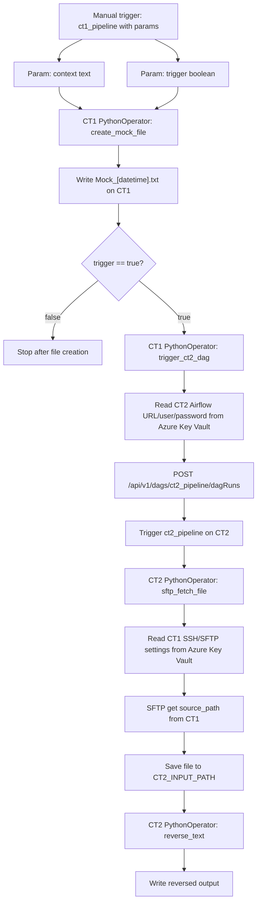

# CrossServer Airflow POC

This folder contains the CT1 -> CT2 flow in the classic Airflow DAG +
PythonOperator style. Cross-server secrets are read from Azure Key Vault.



## Architecture

```text
CrossServer/
|-- CT1.py                    # CT1 DAG: create file -> optionally trigger CT2
|-- CT2.py                    # CT2 DAG: fetch file -> reverse text
|-- .env.example
`-- README.md
```

## File groups

| Group | Files | Purpose |
| --- | --- | --- |
| CT1 DAG | `CT1.py` | Creates the mock file, optionally triggers the CT2 Airflow DAG, and keeps CT1-specific config. |
| CT2 DAG | `CT2.py` | Fetches the file from CT1 over SFTP, writes reversed output, and keeps CT2-specific config. |
| Environment example | `.env.example` | Lists variables needed by CT1 and CT2. |
| Documentation | `README.md` | Explains the architecture, flow, and required environment variables. |

## Required environment variables

CT1 needs:

```bash
CT1_OUTPUT_DIR=/tmp/crossserver/out
VAULT_URL=https://kv-airflow-demo.vault.azure.net/
CT2_DAG_ID=ct2_pipeline
CT2_INPUT_PATH=/tmp/crossserver/in/mock.txt
```

`ct1_pipeline` params:

```json
{
  "context": "Text to write into the mock file",
  "trigger": true
}
```

CT2 needs:

```bash
VAULT_URL=https://kv-airflow-demo.vault.azure.net/
CT1_SFTP_PORT=22
CT2_INPUT_PATH=/tmp/crossserver/in/mock.txt
CT2_REVERSED_OUTPUT_PATH=/tmp/crossserver/out/mock_reversed.txt
```

Required Azure Key Vault secrets:

```text
CT2-AIRFLOW-URL
CT2-AIRFLOW-USER
CT2-AIRFLOW-PASSWORD
CT1-HOST
CT1-USER
CT1-PASSWORD
```

Azure authentication must be available to `DefaultAzureCredential`, for example
Azure CLI login, managed identity, or service principal environment variables.

If Airflow runs inside Docker on CT1, make sure `CT1_OUTPUT_DIR` is bind-mounted
to the VM host path that CT2 can access through SFTP.
