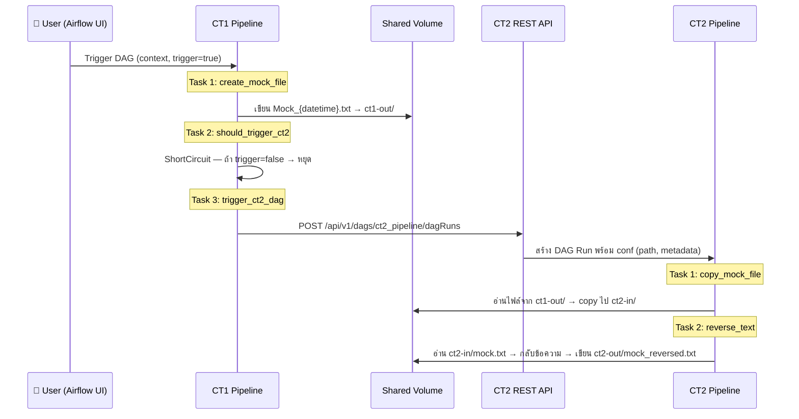

# CrossServer — Cross-Server Airflow Pipeline (POC)

จำลองการส่งงานข้ามเซิร์ฟเวอร์ระหว่าง **Airflow 2 ตัว** (CT1 → CT2)
โดยใช้ Docker Compose สร้าง Airflow cluster 2 ชุด พร้อม shared volume สำหรับส่งไฟล์ระหว่างกัน

---

## สารบัญ

- [Architecture](#architecture)
- [Pipeline Flow](#pipeline-flow)
- [Project Structure](#project-structure)
- [Prerequisites](#prerequisites)
- [Getting Started](#getting-started)
- [DAG Parameters](#dag-parameters)
- [Environment Variables](#environment-variables)
- [Tech Stack](#tech-stack)

---

## Architecture

```
┌──────────────────────────────────────────────────────────────────────┐
│                        Docker Compose Network                        │
│                                                                      │
│  ┌─────────────────────────────┐   ┌─────────────────────────────┐  │
│  │         CT1 (Server 1)      │   │         CT2 (Server 2)      │  │
│  │                             │   │                             │  │
│  │  ┌───────────┐ ┌─────────┐ │   │  ┌───────────┐ ┌─────────┐ │  │
│  │  │ Webserver │ │Scheduler│ │   │  │ Webserver │ │Scheduler│ │  │
│  │  │  :8081    │ │         │ │   │  │  :8082    │ │         │ │  │
│  │  └───────────┘ └─────────┘ │   │  └───────────┘ └─────────┘ │  │
│  │         │                  │   │         │                  │  │
│  │  ┌──────┴──────┐          │   │  ┌──────┴──────┐          │  │
│  │  │ PostgreSQL  │          │   │  │ PostgreSQL  │          │  │
│  │  │ (metadata)  │          │   │  │ (metadata)  │          │  │
│  │  └─────────────┘          │   │  └─────────────┘          │  │
│  │         │                  │   │         │                  │  │
│  │  ┌──────┴──────┐          │   │  ┌──────┴──────┐          │  │
│  │  │  CT1.py     │          │   │  │  CT2.py     │          │  │
│  │  │  (DAG)      │          │   │  │  (DAG)      │          │  │
│  │  └──────┬──────┘          │   │  └──────┬──────┘          │  │
│  └─────────┼──────────────────┘   └─────────┼──────────────────┘  │
│            │                                │                      │
│            │  ① REST API Trigger            │                      │
│            │  POST /api/v1/dags/.../dagRuns  │                      │
│            └────────────────────────────────>│                      │
│                                                                      │
│  ┌───────────────────── Shared Docker Volume ─────────────────────┐  │
│  │                                                                │  │
│  │  ct1-out/        ct2-in/           ct2-out/                   │  │
│  │  Mock_*.txt  ──> mock.txt      ──> mock_reversed.txt          │  │
│  │  (CT1 writes)    (CT2 copies)      (CT2 writes)               │  │
│  │                                                                │  │
│  └────────────────────────────────────────────────────────────────┘  │
└──────────────────────────────────────────────────────────────────────┘
```

**การสื่อสารระหว่าง CT1 ↔ CT2 มี 2 ช่องทาง:**

| ช่องทาง | ใช้ทำอะไร |
|---------|-----------|
| **REST API** | CT1 เรียก Airflow REST API ของ CT2 เพื่อ trigger DAG Run |
| **Shared Volume** | ส่งไฟล์ข้อมูลจริง — CT1 เขียน, CT2 อ่าน |

---

## Pipeline Flow



### CT1 — `ct1_pipeline`

| Task | คำอธิบาย |
|------|----------|
| `create_mock_file` | สร้างไฟล์ข้อความ Mock พร้อม timestamp ลงใน shared volume |
| `should_trigger_ct2` | ShortCircuitOperator — ตรวจ param `trigger` ถ้า `false` จะ skip task ถัดไป |
| `trigger_ct2_dag` | เรียก Airflow REST API ของ CT2 เพื่อ trigger `ct2_pipeline` พร้อมส่ง metadata |

### CT2 — `ct2_pipeline`

| Task | คำอธิบาย |
|------|----------|
| `copy_mock_file` | Copy ไฟล์จาก shared volume (ct1-out/) ไปยัง ct2-in/ |
| `reverse_text` | อ่านไฟล์ แล้วกลับลำดับตัวอักษร (reverse) แล้วเขียนผลลัพธ์ลง ct2-out/ |

---

## Project Structure

```
CrossServer/
├── CT1.py                # DAG สำหรับ Server 1 (สร้างไฟล์ + trigger CT2)
├── CT2.py                # DAG สำหรับ Server 2 (copy + reverse text)
├── docker-compose.yml    # สร้าง Airflow 2 ชุด + PostgreSQL 2 ตัว
├── .env.example          # ตัวอย่าง environment variables
├── .gitignore
├── QUESTION.md           # Q&A อธิบาย concept ต่างๆ ในโค้ด
├── README.md             # ← ไฟล์นี้
└── data/
    ├── ct1-out/          # CT1 เขียนไฟล์ Mock ลงที่นี่
    ├── ct2-in/           # CT2 copy ไฟล์จาก ct1-out มาที่นี่
    └── ct2-out/          # CT2 เขียนผลลัพธ์ (reversed text) ที่นี่
```

---

## Prerequisites

- [Docker Desktop](https://www.docker.com/products/docker-desktop/) (v20+)
- [Docker Compose](https://docs.docker.com/compose/) (v2+)
- RAM อย่างน้อย 4 GB (แนะนำ 6 GB — รัน Airflow 2 ชุดพร้อมกัน)

---

## Getting Started

### 1. สร้าง `.env` file

```bash
cp .env.example .env
```

### 2. Build และ Start

```bash
# อยู่ใน CrossServer/
docker compose up --build -d
```

### 3. เข้า Airflow UI

| Server | URL | Username | Password |
|--------|-----|----------|----------|
| CT1 | [http://localhost:8081](http://localhost:8081) | `airflow` | `airflow` |
| CT2 | [http://localhost:8082](http://localhost:8082) | `airflow` | `airflow` |

### 4. Unpause & Trigger

1. เข้า **CT1** → Unpause `ct1_pipeline`
2. เข้า **CT2** → Unpause `ct2_pipeline`
3. กลับมาที่ **CT1** → Trigger `ct1_pipeline` (ใส่ params ตามต้องการ)
4. ดูผลลัพธ์ที่ **CT2** หรือในโฟลเดอร์ `data/`

### 5. หยุด Services

```bash
docker compose down          # หยุด containers
docker compose down -v       # หยุด + ลบ volumes (reset ทั้งหมด)
```

---

## DAG Parameters

### `ct1_pipeline`

| Parameter | Type | Default | คำอธิบาย |
|-----------|------|---------|----------|
| `context` | string | `"Hello from CT1 Docker container"` | ข้อความที่เขียนลงไฟล์ Mock |
| `trigger` | boolean | `true` | `true` = trigger CT2 หลังสร้างไฟล์, `false` = หยุดแค่ CT1 |

### `ct2_pipeline`

ไม่มี user-facing params — รับ config จาก `dag_run.conf` ที่ CT1 ส่งมา:

| Config Key | คำอธิบาย |
|------------|----------|
| `source_path` | path ของไฟล์ต้นทางใน shared volume |
| `target_path` | path ที่จะ copy ไฟล์ไป |
| `filename` | ชื่อไฟล์ |
| `source_created_at` | timestamp ตอนสร้างไฟล์ |
| `source_bytes` | ขนาดไฟล์ (bytes) |

---

## Environment Variables

| Variable | Default | คำอธิบาย |
|----------|---------|----------|
| `AIRFLOW_UID` | `50000` | UID ของ user ใน container |
| `CT1_AIRFLOW_USER` | `airflow` | Username สำหรับ CT1 Webserver |
| `CT1_AIRFLOW_PASSWORD` | `airflow` | Password สำหรับ CT1 Webserver |
| `CT2_AIRFLOW_URL` | `http://ct2-webserver:8080` | URL ของ CT2 Airflow (internal Docker network) |
| `CT2_AIRFLOW_USER` | `airflow` | Username สำหรับเข้า CT2 REST API |
| `CT2_AIRFLOW_PASSWORD` | `airflow` | Password สำหรับเข้า CT2 REST API |
| `CT2_DAG_ID` | `ct2_pipeline` | DAG ID ที่จะ trigger บน CT2 |
| `CT1_OUTPUT_DIR` | `/opt/airflow/shared/ct1-out` | path สำหรับ CT1 เขียนไฟล์ |
| `CT2_INPUT_PATH` | `/opt/airflow/shared/ct2-in/mock.txt` | path สำหรับ CT2 รับไฟล์ |
| `CT2_REVERSED_OUTPUT_PATH` | `/opt/airflow/shared/ct2-out/mock_reversed.txt` | path สำหรับ CT2 เขียนผลลัพธ์ |
| `REQUEST_TIMEOUT_SECONDS` | `30` | timeout สำหรับ HTTP request |

---

## Tech Stack

| Component | Technology |
|-----------|-----------|
| Orchestrator | Apache Airflow 2.10.4 |
| Runtime | Python 3.11 |
| Metadata DB | PostgreSQL 16 (x2 — แยกกันคนละ server) |
| Infrastructure | Docker Compose |
| Inter-server Trigger | Airflow REST API (`/api/v1/dags/.../dagRuns`) |
| File Sharing | Docker shared volumes |
| DAG Style | Classic (`DAG` + `PythonOperator`) |
