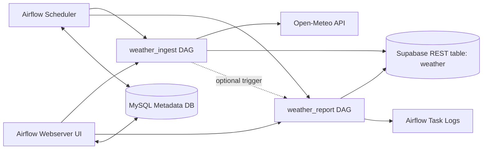
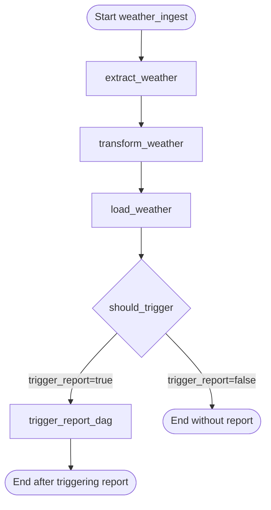
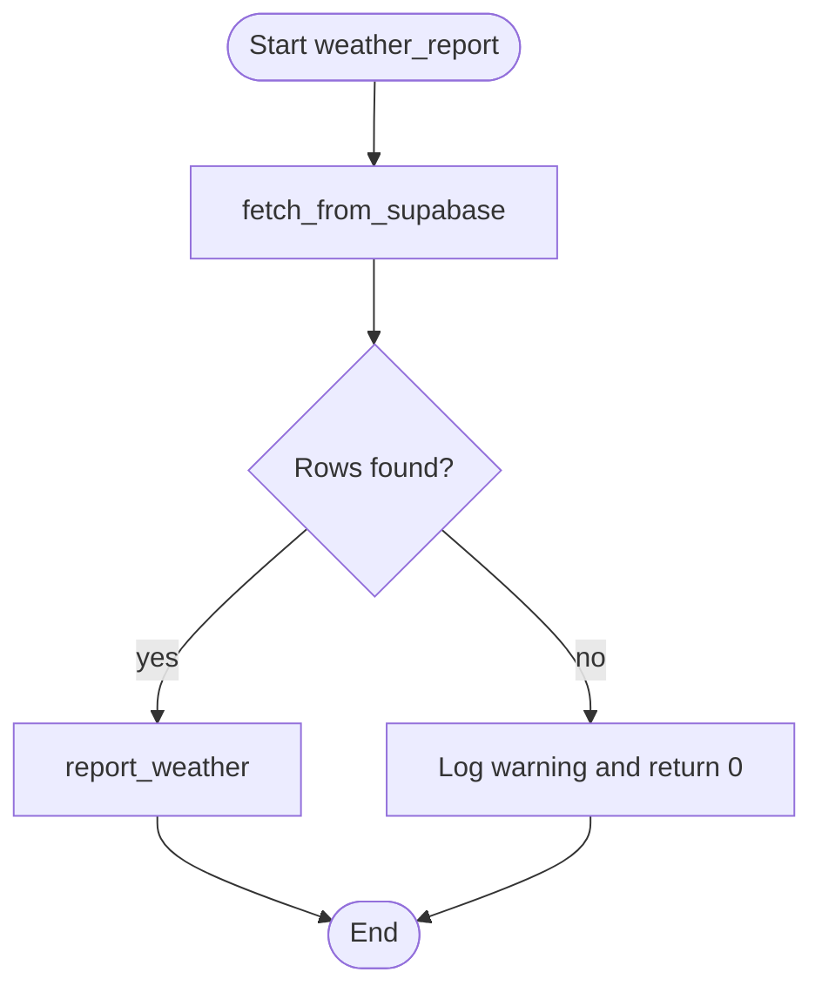
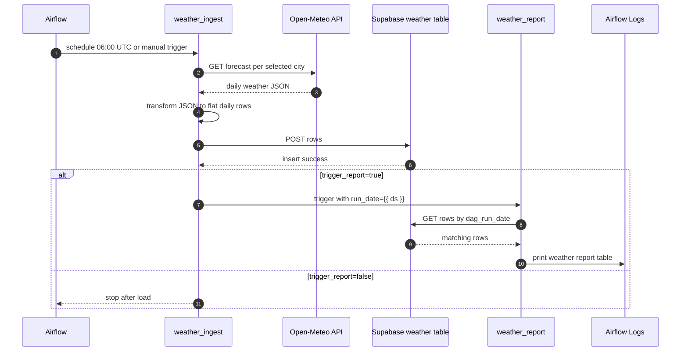

# DAG Flow - Weather Pipeline

เอกสารนี้อธิบาย flow ของ DAG ตามโค้ดปัจจุบันใน `WeatherDag/`

- `dag_ingest.py` สร้าง DAG ID `weather_ingest`
- `dag_report.py` สร้าง DAG ID `weather_report`
- `config.py` เก็บค่า shared config เช่น API, cities, thresholds, Supabase และ default args

## ภาพรวมระบบ

## DAG 1: `weather_ingest`

`weather_ingest` เป็น DAG หลักสำหรับดึงข้อมูลพยากรณ์อากาศจาก Open-Meteo, แปลงข้อมูล, บันทึกลง Supabase และเลือกได้ว่าจะ trigger report ต่อหรือไม่

Schedule: `0 6 * * *` หรือทุกวันเวลา 06:00 UTC

### Parameters

| Param | Default | รายละเอียด |
|---|---:|---|
| `forecast_days` | `7` | จำนวนวันพยากรณ์ที่ดึงจาก API, จำกัด `1` ถึง `16` |
| `cities` | ทุกเมืองใน `CITIES` | รายชื่อเมืองที่ต้องการดึงข้อมูล |
| `trigger_report` | `true` | ถ้าเป็น `true` จะ trigger DAG `weather_report` หลัง load สำเร็จ |

### Task Diagram

### Step by Step

1. `extract_weather`
   - อ่าน `forecast_days` และ `cities` จาก Airflow params
   - กรองเมืองให้เหลือเฉพาะชื่อที่มีใน `CITIES`
   - เรียก Open-Meteo API ทีละเมืองด้วย `requests.get`
   - ขอ fields ตาม `API_PARAMS`: `temperature_2m_max`, `temperature_2m_min`, `precipitation_sum`, `windspeed_10m_max`, `weathercode`
   - คืนค่า raw payload เป็น list ผ่าน XCom

2. `transform_weather`
   - รับ raw payload จาก `extract_weather`
   - เรียก `_flatten_city` เพื่อแปลง daily arrays เป็น rows รายวัน
   - คำนวณ `temp_mean_c` จาก `(temp_max_c + temp_min_c) / 2`
   - คำนวณ `temp_range_c` จาก `temp_max_c - temp_min_c`
   - แปลง `weathercode` เป็น `weather_summary` ด้วย `WMO_CODES`
   - เติม flags:
     - `rain_flag` เป็น `true` เมื่อ `precipitation_mm > 0`
     - `hot_flag` เป็น `true` เมื่อ `temp_max_c >= HOT_THRESHOLD_C`
     - `cold_flag` เป็น `true` เมื่อ `temp_min_c <= COLD_THRESHOLD_C`
   - คืนค่า transformed rows ผ่าน XCom

3. `load_weather`
   - รับ rows จาก `transform_weather`
   - ส่ง `POST` ไปที่ Supabase REST endpoint: `/rest/v1/weather`
   - ใช้ headers `apikey`, `Authorization`, `Content-Type`, `Content-Profile`, `Prefer`
   - คืนค่าจำนวน rows ที่ insert

4. `should_trigger`
   - ใช้ `ShortCircuitOperator`
   - อ่าน param `trigger_report`
   - ถ้า `false` จะ skip task ถัดไป
   - ถ้า `true` จะปล่อยให้ task `trigger_report_dag` ทำงานต่อ

5. `trigger_report_dag`
   - ใช้ `TriggerDagRunOperator`
   - trigger DAG ID `weather_report`
   - ส่ง `conf={"run_date": "{{ ds }}"}` ให้ report DAG
   - ตั้ง `wait_for_completion=False` จึงไม่รอให้ report DAG จบ

## DAG 2: `weather_report`

`weather_report` อ่านข้อมูลจาก Supabase ตาม `run_date` แล้ว print รายงานแบบตารางออก Airflow task log

Schedule: `30 6 * * *` หรือทุกวันเวลา 06:30 UTC

Trigger ได้ 2 ทาง:

- จาก schedule ของตัวเอง
- จาก `weather_ingest` เมื่อ `trigger_report=true`
- Trigger manual ผ่าน Airflow UI พร้อมกำหนด `run_date`

### Parameters

| Param | Default | รายละเอียด |
|---|---|---|
| `run_date` | `""` | วันที่ต้องการ report รูปแบบ `YYYY-MM-DD`; ถ้าว่างจะใช้วันที่ปัจจุบัน |

### Task Diagram

### Step by Step

1. `fetch_from_supabase`
   - อ่าน `run_date` จาก Airflow params
   - ถ้า `run_date` ว่าง จะใช้ `date.today()`
   - ส่ง `GET` ไปที่ Supabase REST endpoint:
     - `/rest/v1/weather?dag_run_date=eq.{run_date}`
   - คืนค่า rows ที่ได้จาก Supabase ผ่าน XCom

2. `report_weather`
   - รับ rows จาก `fetch_from_supabase`
   - ถ้าไม่มีข้อมูล จะ log warning และ return `0`
   - จัดกลุ่มข้อมูลด้วย `city`
   - print ตารางลง Airflow log โดยแสดง `Date`, `Summary`, `Max°C`, `Min°C`, `Rain mm`, `Flags`
   - Flags ที่แสดงได้คือ `HOT`, `COLD`, `RAIN`; ถ้าไม่มี flag จะแสดง `-`
   - return จำนวน rows ที่ report

## End-to-End Flow

## Data Columns Produced by `transform_weather`

| Column | ที่มา |
|---|---|
| `city` | ชื่อเมืองจาก `CITIES` |
| `latitude` | config ของเมือง |
| `longitude` | config ของเมือง |
| `date` | `daily.time` จาก Open-Meteo |
| `temp_max_c` | `daily.temperature_2m_max` |
| `temp_min_c` | `daily.temperature_2m_min` |
| `temp_mean_c` | ค่าเฉลี่ยของ max/min |
| `temp_range_c` | ส่วนต่าง max/min |
| `precipitation_mm` | `daily.precipitation_sum` |
| `windspeed_kmh` | `daily.windspeed_10m_max` |
| `weather_summary` | map จาก `weathercode` ด้วย `WMO_CODES` |
| `rain_flag` | `precipitation_mm > 0` |
| `hot_flag` | `temp_max_c >= 35` |
| `cold_flag` | `temp_min_c <= 10` |

หมายเหตุ: `weather_report` filter ด้วยคอลัมน์ `dag_run_date` ใน Supabase ดังนั้น table `weather` ต้องมีคอลัมน์นี้ หรือมี default/trigger ฝั่งฐานข้อมูลที่เติมค่าให้ตอน insert

## Config ที่เกี่ยวข้อง

| Config | ค่า/รายละเอียด |
|---|---|
| `API_URL` | `https://api.open-meteo.com/v1/forecast` |
| `API_TIMEOUT` | `30` seconds |
| `SUPABASE_URL` | อ่านจาก env `SUPABASE_URL` |
| `SUPABASE_KEY` | อ่านจาก env `SUPABASE_KEY` |
| `SUPABASE_SCHEMA` | `public` |
| `SUPABASE_TABLE` | `weather` |
| `HOT_THRESHOLD_C` | `35` |
| `COLD_THRESHOLD_C` | `10` |
| `CITIES` | Bangkok, Tokyo, London, New York, Sydney |
