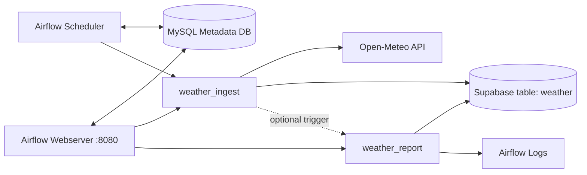
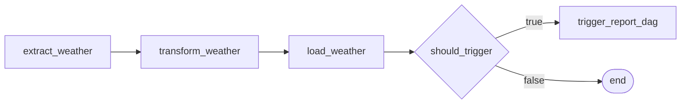
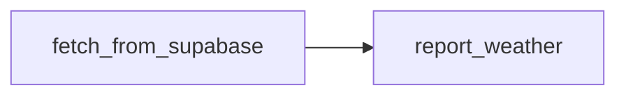

# POC-Airflow - Weather Pipeline

Proof of Concept สำหรับ Apache Airflow ที่รันด้วย Docker Compose โดยมี 2 DAG หลัก:

- `weather_ingest`: ดึงข้อมูลจาก Open-Meteo, transform, แล้ว load เข้า Supabase
- `weather_report`: อ่านข้อมูลจาก Supabase แล้ว print รายงานลง Airflow log

ดู flow แบบละเอียดได้ที่ [FLOW.md](FLOW.md)

## เป้าหมายของโปรเจค

1. ศึกษาการเขียน DAG ด้วย Airflow TaskFlow API และ Operators
2. สาธิต ETL flow แบบ Extract -> Transform -> Load -> Report
3. ใช้ Docker Compose เพื่อรัน Airflow Webserver, Scheduler และ metadata DB
4. เชื่อมต่อ external services คือ Open-Meteo API และ Supabase REST API

## สถาปัตยกรรมระบบ



## Services ใน Docker Compose

| Service | หน้าที่ |
|---|---|
| `airflow-webserver` | Airflow UI/API ที่ `http://localhost:8080` |
| `airflow-scheduler` | ตรวจ schedule และสร้าง task instances |
| `mysql` | Airflow metadata database |
| `airflow-init` | one-shot bootstrap สำหรับ migrate DB และสร้าง admin user |

Executor ที่ใช้คือ `LocalExecutor` จึงไม่ต้องมี Redis, Celery Worker หรือ Kubernetes cluster

## DAGs

### `weather_ingest`

ไฟล์: `WeatherDag/dag_ingest.py`

Schedule: `0 6 * * *` หรือทุกวัน 06:00 UTC

Flow:



Params:

| Param | Default | รายละเอียด |
|---|---:|---|
| `forecast_days` | `7` | จำนวนวันพยากรณ์จาก Open-Meteo, ช่วง `1` ถึง `16` |
| `cities` | ทุกเมือง | รายชื่อเมืองจาก `CITIES` |
| `trigger_report` | `true` | trigger `weather_report` ต่อหลัง load สำเร็จ |

### `weather_report`

ไฟล์: `WeatherDag/dag_report.py`

Schedule: `30 6 * * *` หรือทุกวัน 06:30 UTC

Flow:



Params:

| Param | Default | รายละเอียด |
|---|---|---|
| `run_date` | `""` | วันที่ต้องการ report ในรูปแบบ `YYYY-MM-DD`; ถ้าว่างจะใช้วันที่ปัจจุบัน |

## Data Flow

1. `weather_ingest` อ่าน params จาก Airflow run
2. `extract_weather` เรียก Open-Meteo API ตามเมืองและจำนวนวันที่เลือก
3. `transform_weather` flatten daily arrays เป็น rows และคำนวณ metrics/flags
4. `load_weather` insert rows เข้า Supabase table `weather`
5. ถ้า `trigger_report=true`, task `trigger_report_dag` จะ trigger DAG `weather_report` พร้อม `run_date={{ ds }}`
6. `weather_report` อ่าน rows จาก Supabase ด้วย filter `dag_run_date=eq.{run_date}`
7. `report_weather` group by `city` แล้ว print รายงานลง Airflow log

## Data Fields

| Field | รายละเอียด |
|---|---|
| `temperature_2m_max` | อุณหภูมิสูงสุดจาก Open-Meteo |
| `temperature_2m_min` | อุณหภูมิต่ำสุดจาก Open-Meteo |
| `precipitation_sum` | ปริมาณฝนรวม |
| `windspeed_10m_max` | ความเร็วลมสูงสุด |
| `weathercode` | WMO weather code |
| `temp_mean_c` | `(temp_max_c + temp_min_c) / 2` |
| `temp_range_c` | `temp_max_c - temp_min_c` |
| `weather_summary` | ข้อความที่ map จาก `WMO_CODES` |
| `rain_flag` | `true` เมื่อ `precipitation_mm > 0` |
| `hot_flag` | `true` เมื่อ `temp_max_c >= 35` |
| `cold_flag` | `true` เมื่อ `temp_min_c <= 10` |

เมืองเริ่มต้น: Bangkok, Tokyo, London, New York, Sydney

หมายเหตุ: `weather_report` filter ด้วยคอลัมน์ `dag_run_date` ดังนั้น Supabase table `weather` ต้องมีคอลัมน์นี้ หรือมี default/trigger ที่เติมค่าให้ตรงกับวันที่ run

## โครงสร้างโปรเจค

```text
POC-Airflow/
├── docker-compose.yml
├── Dockerfile
├── requirements.txt
├── README.md
├── TOOL.md
├── FLOW.md
└── WeatherDag/
    ├── dag_ingest.py
    ├── dag_report.py
    └── config.py
```

ใน `docker-compose.yml` โฟลเดอร์ `WeatherDag` ถูก mount ไปที่ `/opt/airflow/dags`

## Environment Variables

ต้องมีค่าเหล่านี้ใน `.env` หรือ environment ก่อนรัน container:

```env
SUPABASE_URL=https://your-project.supabase.co
SUPABASE_KEY=your-supabase-service-or-api-key
```

## Quick Start

```bash
# 1. สร้างโฟลเดอร์ runtime
mkdir -p logs plugins

# 2. Build image
docker compose build

# 3. Initialize Airflow
docker compose up airflow-init

# 4. Start services
docker compose up -d

# 5. เปิด Airflow UI
# http://localhost:8080
# Login: airflow / airflow
```

หลังเปิด UI ให้ unpause `weather_ingest` และ `weather_report` ตามต้องการ หรือ trigger ด้วยมือจากหน้า DAGs

## เอกสารเพิ่มเติม

- [FLOW.md](FLOW.md) - diagram และ step-by-step DAG flow
- [TOOL.md](TOOL.md) - คู่มือรันและคำสั่งที่ใช้บ่อย
- [Apache Airflow Documentation](https://airflow.apache.org/docs/)
- [Open-Meteo API Documentation](https://open-meteo.com/en/docs)
- [Supabase REST API Documentation](https://supabase.com/docs/guides/api)
