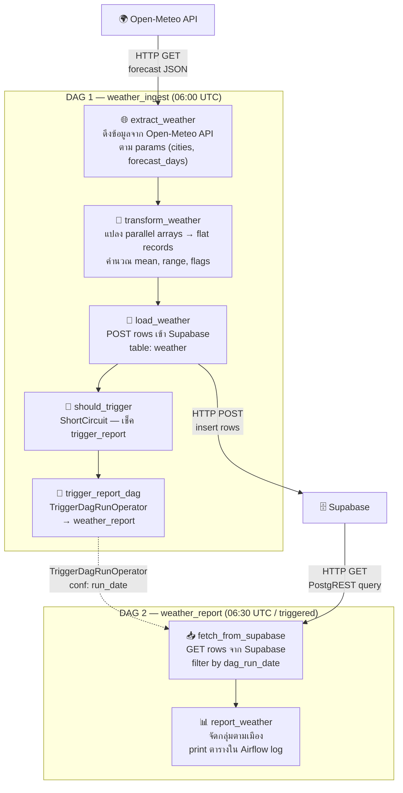

# Weathering — Weather ETL Pipeline (POC)

ดึงข้อมูลพยากรณ์อากาศจาก **Open-Meteo API** → แปลงข้อมูล → โหลดลง **Supabase** → สร้าง Report
ประกอบด้วย 2 DAGs ที่ทำงานต่อเนื่องกัน: **Ingest** (ETL) และ **Report** (อ่าน + แสดงผล)

---

## สารบัญ

- [Architecture](#architecture)
- [Pipeline Flow](#pipeline-flow)
- [Project Structure](#project-structure)
- [Prerequisites](#prerequisites)
- [Configuration](#configuration)
- [DAG Parameters](#dag-parameters)
- [Tech Stack](#tech-stack)

---

## Architecture

```
┌──────────────────────────────────────────────────────────────────────┐
│                         Airflow (CT1 Server)                         │
│                                                                      │
│  ┌────────────────────────────────────────────────────────────────┐  │
│  │                    DAG 1: weather_ingest                       │  │
│  │                   (Schedule: 06:00 UTC daily)                  │  │
│  │                                                                │  │
│  │  ┌──────────┐   ┌───────────┐   ┌──────┐   ┌──────────────┐  │  │
│  │  │ Extract  │──>│ Transform │──>│ Load │──>│ShortCircuit  │  │  │
│  │  │          │   │           │   │      │   │(gate)        │  │  │
│  │  └──────────┘   └───────────┘   └──────┘   └──────┬───────┘  │  │
│  │       │                              │             │          │  │
│  │       ▼                              ▼             ▼          │  │
│  │  Open-Meteo API               Supabase DB    ┌──────────┐   │  │
│  │  (forecast data)              (insert rows)  │ Trigger  │   │  │
│  │                                              │ DAG 2    │   │  │
│  │                                              └────┬─────┘   │  │
│  └───────────────────────────────────────────────────┼──────────┘  │
│                                                      │             │
│  ┌───────────────────────────────────────────────────┼──────────┐  │
│  │                    DAG 2: weather_report           │          │  │
│  │                   (Schedule: 06:30 UTC daily)     │          │  │
│  │                   (or triggered by DAG 1)          ▼          │  │
│  │                                                               │  │
│  │  ┌───────────────────┐   ┌──────────────────────┐            │  │
│  │  │ Fetch from        │──>│ Report               │            │  │
│  │  │ Supabase          │   │ (log table output)   │            │  │
│  │  └───────────────────┘   └──────────────────────┘            │  │
│  │       │                                                       │  │
│  │       ▼                                                       │  │
│  │  Supabase DB                                                  │  │
│  │  (read rows by date)                                          │  │
│  └───────────────────────────────────────────────────────────────┘  │
│                                                                      │
└──────────────────────────────────────────────────────────────────────┘

            ┌──────────────────────┐
            │   External Services  │
            │                      │
            │  ┌────────────────┐  │
            │  │  Open-Meteo    │  │
            │  │  (Free API)    │  │
            │  └────────────────┘  │
            │                      │
            │  ┌────────────────┐  │
            │  │  Supabase      │  │
            │  │  (PostgreSQL)  │  │
            │  └────────────────┘  │
            └──────────────────────┘
```

**Data Flow:**

```
Open-Meteo API ──(JSON)──> Extract ──(list[dict])──> Transform ──(list[dict])──> Supabase
                                                                                     │
Airflow Log <──(table)── Report <──(list[dict])── Fetch <──(PostgREST query)─────────┘
```

---

## Pipeline Flow



### DAG 1 — `weather_ingest`

| Task | Type | คำอธิบาย |
|------|------|----------|
| `extract_weather` | `@task` | ดึง forecast จาก Open-Meteo API ตาม cities & forecast_days |
| `transform_weather` | `@task` | แปลง nested JSON เป็น flat records, คำนวณ temp_mean, temp_range, flags (HOT/COLD/RAIN) |
| `load_weather` | `@task` | INSERT rows เข้า Supabase table `weather` ผ่าน PostgREST API |
| `should_trigger` | `ShortCircuitOperator` | ตรวจ param `trigger_report` — ถ้า `false` จะ skip trigger |
| `trigger_report_dag` | `TriggerDagRunOperator` | Trigger DAG 2 (`weather_report`) พร้อมส่ง `run_date` |

### DAG 2 — `weather_report`

| Task | Type | คำอธิบาย |
|------|------|----------|
| `fetch_from_supabase` | `@task` | อ่าน rows จาก Supabase โดย filter ด้วย `dag_run_date` |
| `report_weather` | `@task` | จัดกลุ่มตามเมือง, แสดงตารางพยากรณ์อากาศใน Airflow log |

---

## Project Structure

```
Weathering/
├── config.py         # Shared configuration (API, cities, thresholds, Supabase credentials)
├── dag_ingest.py     # DAG 1 — Extract → Transform → Load → [Trigger Report]
├── dag_report.py     # DAG 2 — Fetch from Supabase → Report to log
└── README.md         # ← ไฟล์นี้
```

> **Note:** ไฟล์เหล่านี้ถูก mount เข้า container ของ CT1 ผ่าน `docker-compose.yml`
> ใน `CrossServer/` directory (`../Weathering/` → `/opt/airflow/dags/`)

---

## Prerequisites

- Docker Desktop ที่รัน Airflow อยู่ (ใช้ `CrossServer/docker-compose.yml`)
- Supabase project พร้อม:
  - Table `weather` ใน schema `public`
  - API URL & anon/service key

### Supabase Table Schema

```sql
CREATE TABLE public.weather (
    id              BIGSERIAL PRIMARY KEY,
    city            TEXT NOT NULL,
    latitude        DOUBLE PRECISION,
    longitude       DOUBLE PRECISION,
    date            DATE NOT NULL,
    temp_max_c      DOUBLE PRECISION,
    temp_min_c      DOUBLE PRECISION,
    temp_mean_c     DOUBLE PRECISION,
    temp_range_c    DOUBLE PRECISION,
    precipitation_mm DOUBLE PRECISION DEFAULT 0,
    windspeed_kmh   DOUBLE PRECISION,
    weather_summary TEXT,
    rain_flag       BOOLEAN DEFAULT FALSE,
    hot_flag        BOOLEAN DEFAULT FALSE,
    cold_flag       BOOLEAN DEFAULT FALSE,
    dag_run_date    DATE,
    created_at      TIMESTAMPTZ DEFAULT NOW()
);
```

---

## Configuration

ค่า config ทั้งหมดอยู่ใน `config.py`:

### Open-Meteo API

| ค่า | Default | คำอธิบาย |
|-----|---------|----------|
| `API_URL` | `https://api.open-meteo.com/v1/forecast` | Base URL ของ Open-Meteo |
| `API_PARAMS` | `temperature_2m_max,temperature_2m_min,...` | ฟิลด์ที่ดึงจาก API |
| `FORECAST_DAYS` | `7` | จำนวนวันพยากรณ์ (default, override ได้ผ่าน params) |
| `API_TIMEOUT` | `30` | Timeout สำหรับ HTTP request (วินาที) |

### Cities

| เมือง | Latitude | Longitude |
|-------|----------|-----------|
| Bangkok | 13.7563 | 100.5018 |
| Tokyo | 35.6762 | 139.6503 |
| London | 51.5074 | -0.1278 |
| New York | 40.7128 | -74.0060 |
| Sydney | -33.8688 | 151.2093 |

### Thresholds

| ค่า | Default | คำอธิบาย |
|-----|---------|----------|
| `HOT_THRESHOLD_C` | `35` | อุณหภูมิสูงสุดที่ flag ว่า "HOT" |
| `COLD_THRESHOLD_C` | `10` | อุณหภูมิต่ำสุดที่ flag ว่า "COLD" |

### Supabase

| ค่า | Source | คำอธิบาย |
|-----|--------|----------|
| `SUPABASE_URL` | Environment Variable (required) | URL ของ Supabase project |
| `SUPABASE_KEY` | Environment Variable (required) | API Key (anon หรือ service role) |
| `SUPABASE_SCHEMA` | `public` | Schema ใน Supabase |
| `SUPABASE_TABLE` | `weather` | Table ที่เก็บข้อมูล |

---

## DAG Parameters

### `weather_ingest` (DAG 1)

| Parameter | Type | Default | Range | คำอธิบาย |
|-----------|------|---------|-------|----------|
| `forecast_days` | integer | `7` | 1–16 | จำนวนวันพยากรณ์ที่ดึงจาก API |
| `cities` | array | ทุกเมือง (5 เมือง) | — | รายชื่อเมืองที่ต้องการดึง |
| `trigger_report` | boolean | `true` | — | `true` = trigger DAG 2 หลัง load เสร็จ |

### `weather_report` (DAG 2)

| Parameter | Type | Default | คำอธิบาย |
|-----------|------|---------|----------|
| `run_date` | string | `""` (ใช้วันนี้) | วันที่ต้องการ report (YYYY-MM-DD) |

---

## Data Transformation

### Input (Open-Meteo parallel arrays)

```json
{
  "daily": {
    "time": ["2025-01-01", "2025-01-02"],
    "temperature_2m_max": [36.5, 34.1],
    "temperature_2m_min": [25.0, 24.5],
    "precipitation_sum": [0.0, 5.2],
    "windspeed_10m_max": [12.3, 15.0],
    "weathercode": [0, 61]
  }
}
```

### Output (flat records)

```json
[
  {
    "city": "Bangkok",
    "date": "2025-01-01",
    "temp_max_c": 36.5,
    "temp_min_c": 25.0,
    "temp_mean_c": 30.75,
    "temp_range_c": 11.5,
    "precipitation_mm": 0.0,
    "windspeed_kmh": 12.3,
    "weather_summary": "Clear sky",
    "rain_flag": false,
    "hot_flag": true,
    "cold_flag": false
  }
]
```

### Derived Fields

| Field | Formula | คำอธิบาย |
|-------|---------|----------|
| `temp_mean_c` | `(max + min) / 2` | อุณหภูมิเฉลี่ย |
| `temp_range_c` | `max - min` | ช่วงอุณหภูมิ |
| `weather_summary` | `WMO_CODES[weathercode]` | แปลง WMO code เป็นข้อความ |
| `rain_flag` | `precipitation > 0` | มีฝนหรือไม่ |
| `hot_flag` | `temp_max >= 35°C` | ร้อนจัดหรือไม่ |
| `cold_flag` | `temp_min <= 10°C` | หนาวจัดหรือไม่ |

---

## Report Output Example

ดูได้ใน Airflow UI → คลิก task `report_weather` → Logs:

```
============================================================
WEATHER FORECAST REPORT
============================================================

[Bangkok]
  Date         Summary                Max°C  Min°C  Rain mm Flags
  ----------------------------------------------------------------------
  2025-05-22   Partly cloudy           36.5   25.0      0.0 HOT
  2025-05-23   Slight rain             34.1   24.5      5.2 RAIN

[Tokyo]
  Date         Summary                Max°C  Min°C  Rain mm Flags
  ----------------------------------------------------------------------
  2025-05-22   Clear sky               28.0    8.5      0.0 COLD
  ...

Total rows: 35
============================================================
```

---

## Tech Stack

| Component | Technology |
|-----------|-----------|
| Orchestrator | Apache Airflow 2.10.4 |
| Runtime | Python 3.11 |
| DAG Style | TaskFlow API (`@dag`, `@task`) |
| Data Source | [Open-Meteo API](https://open-meteo.com/) (free, no API key) |
| Data Store | [Supabase](https://supabase.com/) (PostgreSQL + PostgREST) |
| HTTP Client | `requests` |
| Inter-DAG Trigger | `TriggerDagRunOperator` |
